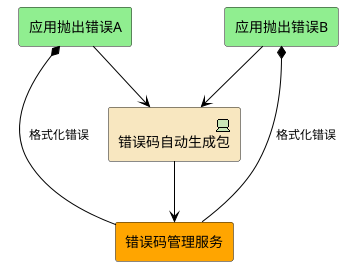
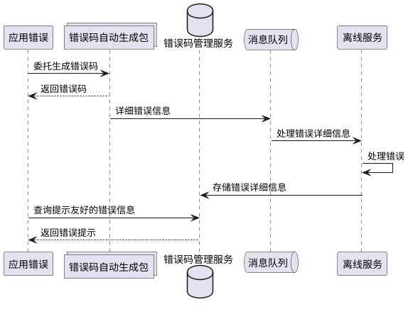
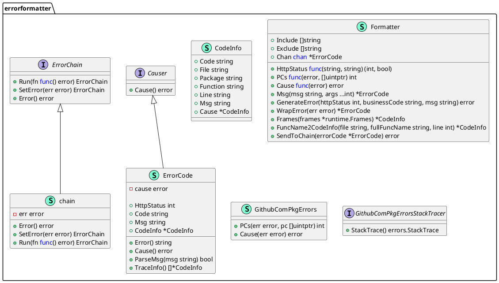
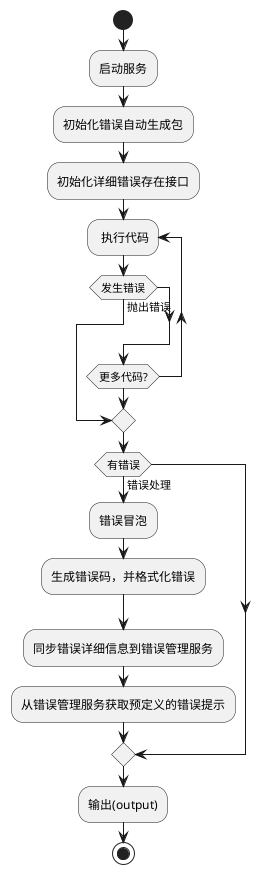

# errorformator

format go err with httpcode、errorcode、message struct

## 业务架构图

```plantuml
@startuml
!define error rectangle #lightgreen
!define errorCodeLib  rectangle #Implementation
!include <archimate/Archimate>
error "应用抛出错误A" as errorA
error "应用抛出错误B" as errorB
archimate #Strategy "错误码自动生成包" as generatorErrorCode  <<technology-device>> 
rectangle "错误码管理服务" as errorManager #orange
errorA -down-> generatorErrorCode
errorB -down->generatorErrorCode
generatorErrorCode -down->errorManager
Rel_Composition_Down(errorB,errorManager,"格式化错误")
Rel_Composition_Down(errorA,errorManager,"格式化错误")
@enduml
```

## 时序图

```plantuml
@startuml
participant error as "应用错误"
collections generatorErrorCode as "错误码自动生成包"
database errorManager as "错误码管理服务"
queue mq as "消息队列"
participant back as "离线服务" 

error -> generatorErrorCode : 委托生成错误码
generatorErrorCode-->error:返回错误码
generatorErrorCode->mq: 详细错误信息
mq->back: 处理错误详细信息
back->back: 处理错误
back->errorManager: 存储错误详细信息
error->errorManager:查询提示友好的错误信息
errorManager-->error: 返回错误提示
@enduml
```

## 错误码生成器uml

```plantuml
@startuml
namespace errorformatter {
    interface Causer  {
        + Cause() error

    }
    class CodeInfo << (S,Aquamarine) >> {
        + Code string
        + File string
        + Package string
        + Function string
        + Line string
        + Msg string
        + Cause *CodeInfo

    }
    interface ErrorChain  {
        + Run(fn <font color=blue>func</font>() error) ErrorChain
        + SetError(err error) ErrorChain
        + Error() error

    }
    class ErrorCode << (S,Aquamarine) >> {
        - cause error

        + HttpStatus int
        + Code string
        + Msg string
        + CodeInfo *CodeInfo

        + Error() string
        + Cause() error
        + ParseMsg(msg string) bool
        + TraceInfo() []*CodeInfo

    }
    class Formatter << (S,Aquamarine) >> {
        + Include []string
        + Exclude []string
        + HttpStatus <font color=blue>func</font>(string, string) (int, bool)
        + PCs <font color=blue>func</font>(error, []uintptr) int
        + Cause <font color=blue>func</font>(error) error
        + Chan <font color=blue>chan</font> *ErrorCode

        + Msg(msg string, args ...int) *ErrorCode
        + GenerateError(httpStatus int, businessCode string, msg string) error
        + WrapError(err error) *ErrorCode
        + Frames(frames *runtime.Frames) *CodeInfo
        + FuncName2CodeInfo(file string, fullFuncName string, line int) *CodeInfo
        + SendToChain(errorCode *ErrorCode) error

    }
    class GithubComPkgErrors << (S,Aquamarine) >> {
        + PCs(err error, pc []uintptr) int
        + Cause(err error) error

    }
    interface GithubComPkgErrorsStackTracer  {
        + StackTrace() errors.StackTrace

    }
    class chain << (S,Aquamarine) >> {
        - err error

        + Error() error
        + SetError(err error) ErrorChain
        + Run(fn <font color=blue>func</font>() error) ErrorChain

    }
}

"errorformatter.Causer" <|-- "errorformatter.ErrorCode"
"errorformatter.ErrorChain" <|-- "errorformatter.chain"

@enduml
```
## 软件执行流程图

```plantuml
@startuml

start
  :启动服务;
  :初始化错误自动生成包;
  :初始化详细错误存在接口;
repeat: 执行代码;
if(发生错误) then(抛出错误)
break
endif
repeat while (更多代码?)
if(有错误)then(错误处理)
:错误冒泡;
:生成错误码，并格式化错误;
:同步错误详细信息到错误管理服务;
:从错误管理服务获取预定义的错误提示;
else 
endif
:输出(output);
stop
@enduml
```