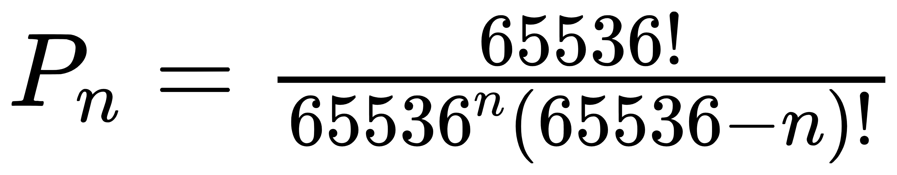
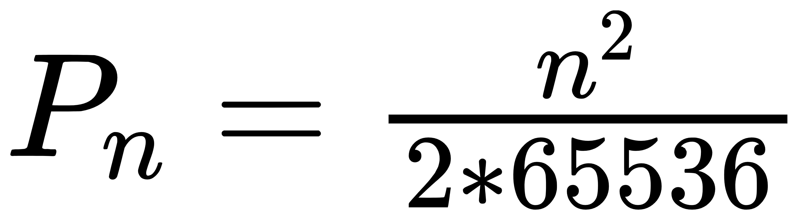
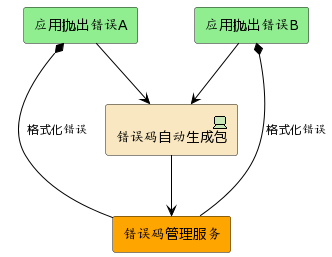
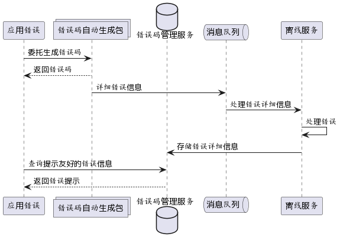
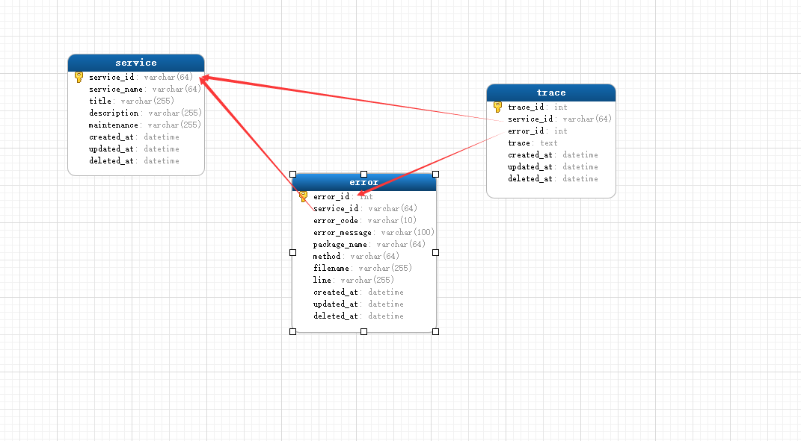

# 软件错误码自动生成和管理方案-设计说明书
## 引言
错误处理是软件开发中重要的环节,错误发生的场景多、频率高,分散在代码的各个地方,导致错误管理成本高. 多人合作、分布式应用导致错误管理难度成指数上升.
大部分大中小型企业实际生产中,错误管理紊乱. 比如:经常将sql错误等敏感信息暴露给用户,既不友好又有安全隐患,又如给出的错误提示不具体明确,增加问题定位难度,导致维护成本高.
基于解决错误处理紊乱无序和管理成本高,本文提出自动生成错误码,统一管理错误码方案
## 软件总体设计
将错误发生的重要信息自动转换成有限位数的散列数字码.一方面将错误码和详细错误信息同步到统一的错误管理平台,另一方面根据错误码从统一管理平台匹配预设的友好错误提示返回给调用方。
发送错误时,优先根据友好提示引导用户操作,其次根据用户提供的错误码在统一错误管理平台上快速查询详细错误信息,从而提升错误处理效率.
### 需求概括
1. 错误码自动生成
2. 错误码管理
2. 错误码查询应用
### 功能概括
1. 错误码生成
    1.1 错误码自动化生成模型设计
2. 错误码管理
    2.1 错误码收集
    2.2 错误码管理
    2.3 错误码查询使用
### 错误码自动生成算法需求
1. 可读性好，最好控制在9-12位字符之间，方便传播
2. 散列性好，不同错误码能均匀分布，撞key概率低
3. 包含必要信息，错误码最好能自说明，如体现错误发生位置等
### 错误码自动生成方案设计
依据算法需求，本软件设计一套基于crc16实现方案:
从错误信息中提炼包名(应用名)、函数名、代码行号作为错误的特征值，将包名(应用名) 和函数名拼接后计算crc16值作为前5位,代码行号采用10进制的4位数作为后4位，最后拼接成占9个字符的字符串
### 错误码自动化生成算法评估
1. 生成的错误码统一使用9位字符的长度，这个长度适合记忆和传播（比如从用户反馈的截图中记忆错误码、人员面对面沟通时9个字符串长度符合人类习惯）.错误码过长不符合人类习惯，过短散列性差，撞码过高不实用. 所以9位数长度很好的平衡了人类习惯和实用性
2. 散列理论值非常大， 满足大多数软件系统错误码设置.  前5位使用包名(应用名)+函数(方法)计算crc16值得出， 散列值域为 0-65536 ,后4位直接使用10进制代码行号，值域为0-9999,每个文件可容纳9999行代码 ,组合后多达6.5亿(655294464)个值.前5位通过包名、函数名散列那能够方便的将相同包名和方法的错误归类，后4位使用文件行号，方便研发在了解提示语上下文时，快速定位问题代码.
### 错误码自动生成撞码及解决方案
1. 撞码概率：
n个 包名/函数名 code码中任意两个不相同的概率记Pn :

简化的近似公式: 
冲突的概率为: 1-pn
通过简化公式,可知n=256 时,冲突的概率达到50%,(使用准确公式n=301)
行号重复的概率就更高了(n=118时,撞key 的概率有50%,实际中小数字行号使用概率非常高，5000以上的使用频率比较低，这导致行号撞码的概率更高)
2. 撞码解决方案
撞码是不可避免的，所以不能将错误码作为唯一标识，因此需要引入记录详细错误信息的管理平台，在错误管理平台中记录错误的上下文、已经更直观的错误信息，通过错误码管理平台进一步准确定位错误

### 错误码自动生成方案优化
1. 实际使用中，发现第三方包抛出错误,记录第三方包名、函数名、行号等信息作用不大。针对这个点，可设置提取错误trace 信息的 包匹配/非匹配 规则,从而控制提取的包名、函数名、文件行号内容
2. 代码不断迭代后，原来的函数名、行号可能发生变化，导致相同错误出现不同的错误码。正对这点，虽然不同版本（迭代生命周期）存在相同错误，不同错误码，但是同一个迭代生命周期内是一一对应的，因此对实际使用影响不大，其次可以通过代码管理工具（如git）跟踪记录代码变迁，从而实现不同错误码之间关联更替。
### 整体架构图
软件采用文件存储错误详细信息. 基于go语言开发.支持linux、window、mac 多平台部署.
整体架构图:

### 时序图
数据中台主要围绕提供数据、处理数据、存储数据构建,具体时序图如下:

### 实体关系设计
软件主要有API、template、source等3个实体,具体字段如下:

### 软件uml图
1. 仓库(RepositoryInterface) 接口负责将容器(VolumeInterface)、模板(Template)、模板元数据(TemplateMeta)、执行器(ExecproviderInterface)等组件组合实现存储、调用、转换数据功能,uml图如下:

2. 执行器(ExecproviderInterface)负责执行数据远程操作,目前实现了数据库(DB),http请求(CURL)调用,uml图如下:

### 软件执行流程
软件接受到输入后,根据输入找到对应api模板,再格式化数据、验证输入、执行主函数,最后格式化输出,具体流程图如下:

